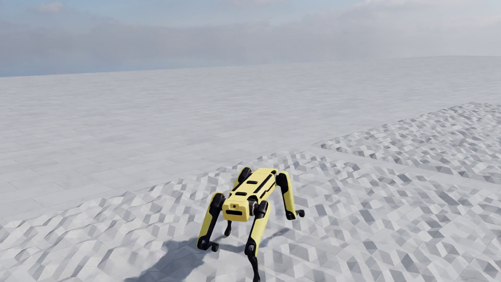

# Spot — RL Locomotion in Isaac Lab



Massively parallel reinforcement-learning simulation of the **Boston Dynamics Spot**
in [NVIDIA Isaac Lab](https://github.com/isaac-sim/IsaacLab), rendered at
1920×1080 with a tracking camera. The quadruped tracks velocity commands on textured flat terrain.

▶ **Demo video:** [`videos/spot-locomotion.mp4`](videos/spot-locomotion.mp4)

## Task

| | |
|---|---|
| Environment | `Isaac-Velocity-Flat-Spot-v0` |
| RL framework | rsl_rl (PPO) |
| Policy | NVIDIA-published pretrained checkpoint (`--use_pretrained_checkpoint`) |
| Sim | Isaac Sim 4.5 · Isaac Lab v2.1.0 · PhysX GPU pipeline |
| Recording | 32 parallel envs, headless, offscreen render |

## Reproduce

```bash
# 1. Install Isaac Sim 4.5 (pip) and Isaac Lab v2.1.0
git clone --branch v2.1.0 https://github.com/isaac-sim/IsaacLab.git
cd IsaacLab && ./isaaclab.sh -i

# 2. Apply the camera-override patch (adds VIEWER_* env vars to play.py)
git apply /path/to/this/repo/patches/isaaclab_play_camera.patch

# 3. Record the rollout (pretrained policy, downloads automatically)
ISAACLAB_DIR=$PWD /path/to/this/repo/scripts/record.sh

# 4. Encode for the web
/path/to/this/repo/scripts/encode.sh rl-video-step-0.mp4 spot-locomotion.mp4

# Or train the policy from scratch instead of using the checkpoint:
ISAACLAB_DIR=$PWD /path/to/this/repo/scripts/train.sh
```

The robot USD asset and the pretrained checkpoint are fetched at runtime from
NVIDIA's Omniverse asset servers — nothing needs to be downloaded manually,
and neither is redistributed in this repo (see
[THIRD_PARTY_NOTICES.md](THIRD_PARTY_NOTICES.md)).

## Camera

The stock Isaac Lab v2.1.0 `play.py` records from a fixed default viewpoint.
`patches/isaaclab_play_camera.patch` adds env-var overrides used for this clip:

```bash
export VIEWER_FOLLOW=robot VIEWER_HIDE_COMMANDS=1 VIEWER_EYE=2.2,2.2,1.1 VIEWER_LOOKAT=0,0,0.4
```

`VIEWER_FOLLOW` locks the camera to the robot's root frame so the shot tracks
it across the terrain; `VIEWER_EYE`/`VIEWER_LOOKAT` set the framing;
`VIEWER_HIDE_COMMANDS` removes debug markers (command arrows, terrain axes)
for clean footage.

## License

Code and video: [BSD-3-Clause](LICENSE). Third-party components (Isaac Lab,
Isaac Sim, NVIDIA checkpoints and robot assets, RL libraries) remain under
their own licenses — see [THIRD_PARTY_NOTICES.md](THIRD_PARTY_NOTICES.md).
